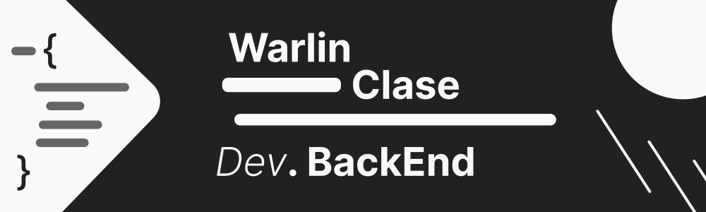

<link rel="stylesheet" type="text/css" href="main.css">

<!-- style="display:block; margin: 0 auto;" --->

<h1 style="margin:0; text-align: center;"><i style="font-weight:200">Dev.</i> <strong>BackEnd</strong></h1>

    <h3 style="width:450px; display:inline-block; after">
        "
        texto uno y no  mas texto uno y no  mastexto uno y no  mas
        "
    </h3>

I am a Java backend developer, I am in the early stages of my professional career looking for opportunities to learn and grow in the programming world.

## Tools

    
    

    <table >
        <tr>
        <th colspan="3">Main technologies</th>
        </tr>
        <tr>
            <td></td>
            <td></td>
            <td></td>
        </tr>
    </table>

## More technologies

<table>
    <tr>
        <th colspan="6">Tools, Languages and Framework</th>
    </tr>
    <tr>
        <!--- herramientas -->
        <td></td>
        <td></td>
        <td></td>
        <!--- lenguajes -->
        <td></td>
        <td></td>
        <td></td>
    </tr>
    <tr>
        <!--- herramientas -->
        <td></td>
        <td></td>
        <td></td>
        <!--- lenguajes -->
        <td></td>
        <td></td>
        <td></td>
    </tr>
    <tr>
    <!--- herramientas -->
        <td></td>
        <td></td>
        <td></td>
        <!--- lenguajes -->
        <td></td>
        <td></td>
        <td></td>
    </tr>
</table>

## Contacts

 

<!--
**W4rl1n26/W4rl1n26** is a ✨ _special_ ✨ repository because its `README.md` (this file) appears on your GitHub profile.

Here are some ideas to get you started:

- 🔭 I’m currently working on ...
- 🌱 I’m currently learning ...
- 👯 I’m looking to collaborate on ...
- 🤔 I’m looking for help with ...
- 💬 Ask me about ...
- 📫 How to reach me: ...
- 😄 Pronouns: ...
- ⚡ Fun fact: ...
-->
