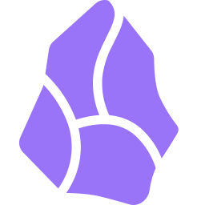

<!-- style="display:block; margin: 0 auto;" --->

    

<h1 align="center"><i>Dev.</i> BackEnd</h1>

    <h3 style="width:450px; display:inline-block;">
        "
        One line, one solution
        "
    </h3>

I am a Java backend developer, I am in the early stages of my professional career looking for opportunities to learn and grow in the programming world.

<!--<h4 align="center"><a href="">View Portafolio</a></h4>-->

## Main tools

<table style="text-align:center;">
    <tr>
        <th colspan="4">Lenguajes</th>
    </tr>
    <tr>
        <td></td>
        <td></td>
        <td></td>
        <td></td>
    </tr>
    <tr>
        <td>HTML</td>
        <td>CSS</td>
        <td>JavaScript</td>
        <td>Java</td>
    </tr>
</table>

## More technologies

<table style="text-align:center;">
    <tr>
        <th colspan="4">Herramientas and Framework</th>
    </tr>
    <tr>
        <td></td>
        <td></td>
        <td></td>
        <td></td>
    </tr>
    <tr>
        <td>Bash</td>
        <td>Git</td>
        <td>Linux</td>
        <td>Figma</td>
    </tr>
    <tr>
        <td></td>
        <td></td>
        <td></td>
        <td></td>
    </tr>
    <tr>
        <td>Postman</td>
        <td>Netbeans</td>
        <td>Sprint boot</td>
        <td>Bootstrap</td>
    </tr>
    <tr>
        <td></td>
        <td></td>
        <td></td>
        <td></td>
    </tr>
    <tr>
        <td>NodeJS</td>
        <td>NPM</td>
        <td>ReactJS</td>
        <td>MySQL</td>
    </tr>
    <tr>
        <td></td>
        <td></td>
        <td></td>
        <td></td>
    </tr>
    <tr>
        <td>ExpressJS</td>
        <td>Notion</td>
        <td>Obsidian</td>
        <td></td>
    </tr>
</table>

<!--
## Contacts

**W4rl1n26/W4rl1n26** is a ✨ _special_ ✨ repository because its `README.md` (this file) appears on your GitHub profile.

 

Here are some ideas to get you started:

- 🔭 I’m currently working on ...
- 🌱 I’m currently learning ...
- 👯 I’m looking to collaborate on ...
- 🤔 I’m looking for help with ...
- 💬 Ask me about ...
- 📫 How to reach me: ...
- 😄 Pronouns: ...
- ⚡ Fun fact: ...
-->
